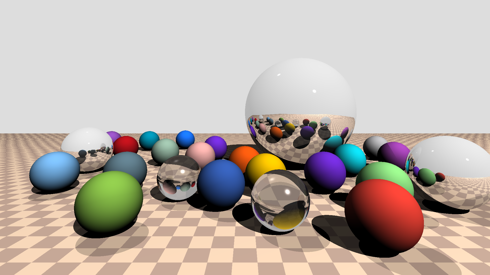

# JS Raytracer
A minimal ray tracing engine written from scratch in JS (TypeScript). 



View an interactive demo [here](https://jamesbarnett.io/raytracer).

No graphics APIs or libraries are used, only a single HTML5 canvas call to draw the generated bitmap image.

Various effects are supported, including recursive optical reflections and refractions, and [Phong shading](https://en.wikipedia.org/wiki/Phong_reflection_model). 
Basic multi-threading is implemented using the [Web Workers API](https://developer.mozilla.org/en-US/docs/Web/API/).

## Building locally
You will need NodeJS >= 10.

Clone this repo and build with webpack:

``` 
$ git clone https://github.com/jamesbarnett91/js-raytracer.git
$ cd js-raytracer
$ npm install
$ npm run serve
```

This will build the project and start a webpack dev server listening on port 9000. Navigate to `http://localhost:9000/` in you browser to view the project. This also enables hot-compiling/reloading on change.

Alternatively, you can build a distributable with `npm run build`. This will compile and bundle the project into `./dist`.

## Useful resources

- https://www.scratchapixel.com/lessons/3d-basic-rendering/introduction-to-ray-tracing
- https://tmcw.github.io/literate-raytracer/
- https://github.com/ssloy/tinyraytracer